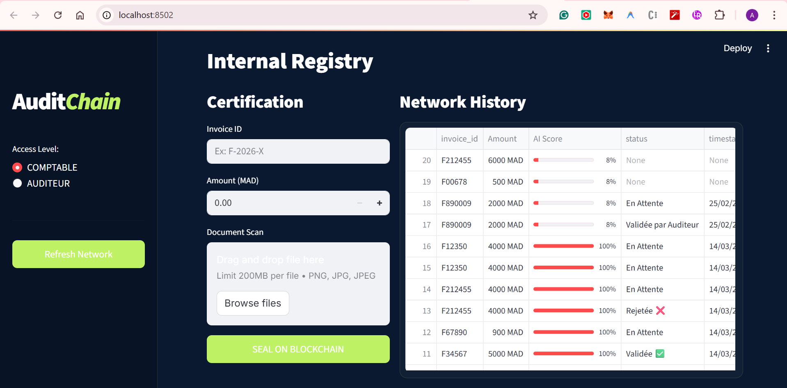
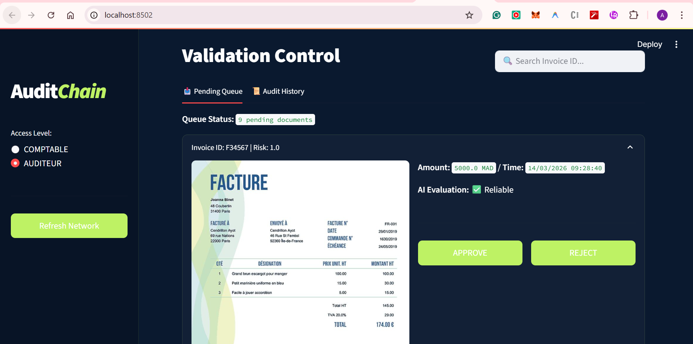
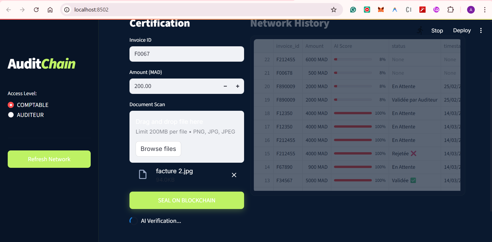

# 🛡️ AuditChain: AI-Powered Blockchain Audit System

**AuditChain** is a decentralized platform designed to revolutionize internal auditing by combining **Deep Learning (CNN)** with **Blockchain technology (Hyperledger Firefly)**. It ensures that every financial invoice is verified for authenticity and stored in a tamper-proof ledger, providing 100% transparency and trust.

---

## 📖 The "Trust" Story

In traditional systems, auditing is manual, slow, and prone to fraud. **AuditChain** solves this by creating a seamless digital journey:

1. **The Guard (AI):** A CNN model (`invoice_audit_model.h5`) automatically analyzes uploaded files. If a user tries to upload a random image that isn't an invoice, the AI flags it immediately.
2. **The Truth (Blockchain):** Once an invoice is uploaded, its data (ID, Amount, AI Score, and Image) is anchored onto **Firefly**. This creates an immutable record that no one can delete or change.

---

## 🕵️ The Auditor’s New Workspace

The Auditor no longer needs to hunt for paperwork. The **Validation Control** dashboard provides:

- **Real-Time Queue:** Every invoice entered by the Accountant appears instantly for review.
- **Visual Verification:** The Auditor sees the original **Invoice Scan** directly in the interface.
- **Decision Power:** With a single click on **Approve** or **Reject**, the Auditor finalizes the process, and the decision is permanently recorded on the blockchain.
- **Smart Forensic Search:** A powerful search bar allows the Auditor to find any past invoice by **ID**, **Date**, or **Time**, with the full history and visual proof displayed instantly.

---

### 📸 Platform Preview

| Accountant View (Certification)             | Auditor View (Validation)                |
| ------------------------------------------- | ---------------------------------------- |
|  |  |

> **Audit History:** Every decision is traceable in the immutable blockchain log.
> 

## 🏗️ Technical Architecture

- **Frontend/Backend:** Built entirely in **Streamlit** for a high-performance, single-file application (`app.py`).
- **Deep Learning:** A **Convolutional Neural Network (CNN)** architecture optimized for document classification.
- **Blockchain Infrastructure:** **Hyperledger Firefly** used for decentralized message broadcasting and data pinning.
- **Data Science Stack:** Python, TensorFlow, Pandas, and NumPy.

---

## 📁 Project Structure

- `app.py`: The core application containing the UI and Blockchain logic.
- `invoice_audit_model.h5`: The trained CNN model for risk assessment.
- `requirements.txt`: List of necessary Python libraries.
- `README.md`: Project documentation and storytelling.

---

## 🚀 Installation & Usage

1.  **Clone the Repo:**
    ```bash
    git clone https://github.com/asmaeissa25/AuditChain-Intelligent-Internal-Audit-System-using-Blockchain-and-CNN.git
    ```
2.  **Install Dependencies:**
    ```bash
    pip install -r requirements.txt
    ```
3.  **Run the Platform:**
    ```bash
    streamlit run app.py
    ```
